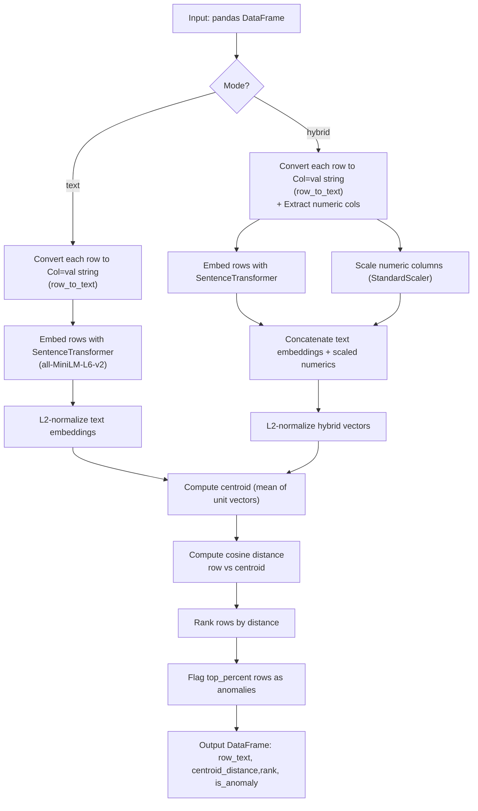

# semantic_sense

**Semantic-Sense** is a hybrid anomaly detection package that combines **semantic embeddings** with **numeric features** to find unusual rows in tabular datasets.  
It is designed for Data Scientists who want to go beyond traditional anomaly detection and capture **semantic relationships** between categorical/textual values while still respecting numeric signals.

---

## What It Does

- Converts each row of a DataFrame into a **text string** (e.g., `item=bread, Price=10`).
- Embeds that row with a lightweight **sentence-transformer model** (`all-MiniLM-L6-v2`).
- (Optional Hybrid Mode) Concatenates **scaled numeric features** into the same representation.
- Scores anomalies by **cosine distance from the centroid** of all embeddings.
- Flags the top *N%* farthest rows as anomalies.

---

## How It’s Different

- **Traditional methods** (e.g., Local Outlier Factor, Isolation Forest) treat categorical variables as dummy/one-hot encoded → every unique value looks “equally far”.
- **Semantic-Sense** understands relationships between values:
    - `"bread"` and `"sandwich"` are closer than `"bread"` and `"meat"`.
- By combining embeddings with numeric features, you get both:
  - Semantic closeness on categorical/text data.
  - Proper scaling on numeric outliers.

---


## Workflow (What happens after passing a DataFrame)




---

## Install  
   - **From GitHub:**  
     ```bash
     pip install git+https://github.com/rezuanurdip/semantic_sense.git
     ```
   - **From PyPI:**  
     ```bash
     pip install semantic-sense
     ```

---

## Examples

Check out the [`example/`](./examples) directory for usage examples.

---

## 📜 License

This project is licensed under the **Apache 2.0 License**.

It bundles the [all-MiniLM-L6-v2](https://huggingface.co/sentence-transformers/all-MiniLM-L6-v2) model  
and relies on the [Sentence-Transformers](https://github.com/UKPLab/sentence-transformers) library,  
both of which are licensed under Apache 2.0.
